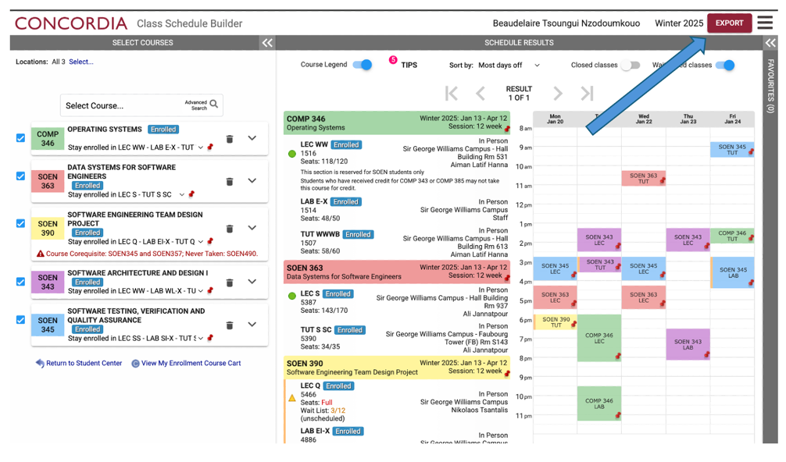
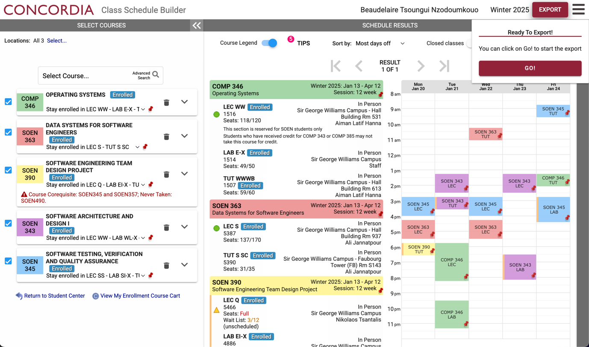
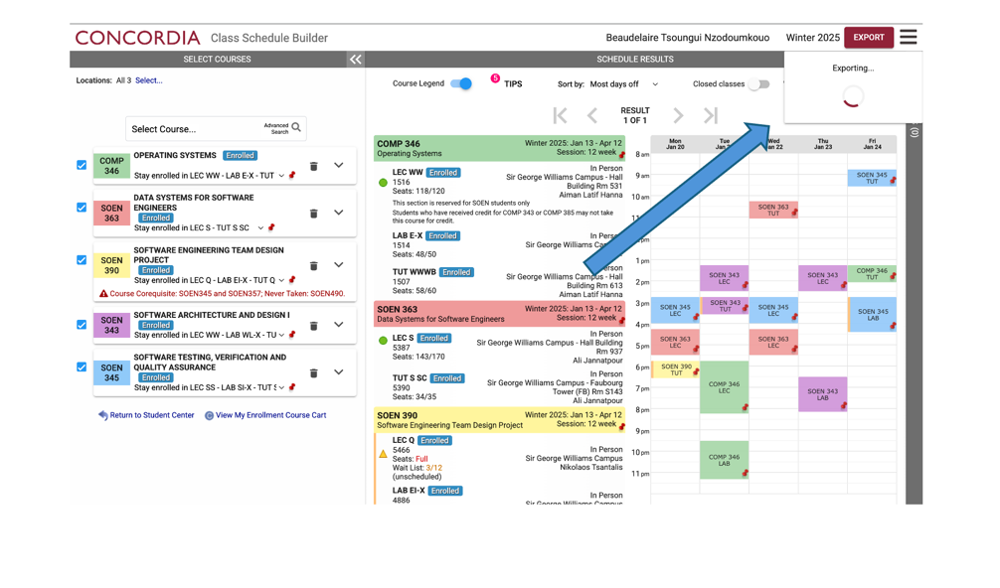
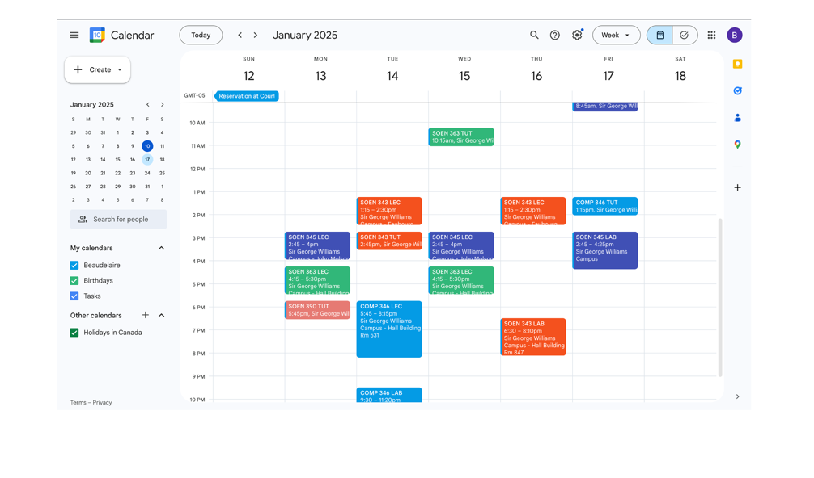

# Visual Schedule Builder Export

# Description
This extension allows you to quickly and effortlessly import your Schedule Builder schedules into Google Calendar.

# Installation

If you'd like to contribute, you can clone this repository and upload it as an unpacked extension by navigating to <a href="chrome://extensions">chrome://extensions</a>, enabling Developer Mode, and selecting "Load Unpacked Extension." You'll also need an API key and client ID.

# Usage
<b>Important:</b> You must be signed in to <em>Chrome</em> (not Google) using the account you wish to use.

1. Finalize your schedule in Schedule Builder as usual. The extension will automatically add an "Export" button to the Schedule Builder interface.

---

2. When you are ready, click Export, Then Go!.

---

3. Your Google Calendar will be automatically populated with your schedule, including labs, tutorials, and other components.

Once the schedule has been exported, you can customize it further in Google Calendar by editing details such as colors, titles, or descriptions. You only need to modify the first event in a series to apply changes to all occurrences.

Feel free to email beaudelaire@tutamail.com with any questions or feedback!
